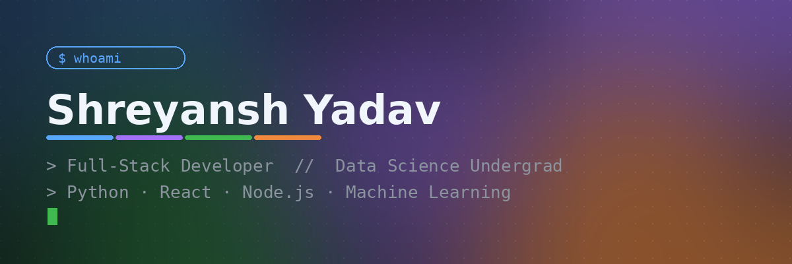

<div align="center">

</div>

<br/>

<table width="100%">
<tr>
<td width="220" align="center" valign="top">

<br/><br/>

`Greater Noida, India`

📍 GL Bajaj Institute of Tech.
🎓 B.Tech CSE (Data Science)
🕐 Class of 2028

<br/>

[](https://www.linkedin.com/in/shreyansh-yadav-2b7856351)
[](mailto:shreyanshyadav26289@gmail.com)
[](https://shreyansh-nmoy.onrender.com)

</td>
<td valign="top">

```json
// about.json
{
  "role"      : "Full-Stack Developer & Data Science Undergrad",
  "currently" : "Interned @ Thiranex — built full-stack apps in prod",
  "stack"     : ["Python", "React", "Node.js", "MongoDB", "Scikit-learn"],
  "focus"     : "AI-driven solutions to real-world problems",
  "fun_fact"  : "I'd rather debug a race condition than skip breakfast"
}
```


**What I'm building right now**
- 🔭 Full-stack products with React / Node / MongoDB — auth, APIs, real UX
- 🤖 ML-driven data tools (Pandas, NumPy, Scikit-learn, Streamlit dashboards)
- 📈 Sharpening DSA + system design fundamentals for the next big build

</td>
</tr>
</table>


### 🧩 Toolbelt

<div align="center">

<br/>
<br/>


</div>


### 🛤️ Experience

<table>
<tr><td width="140" valign="top"><sub><b>Mar–Apr 2026</b></sub></td>
<td>

**Full Stack Development Intern** · *Thiranex, Remote*
Shipped responsive full-stack apps (React · Node · Express · MongoDB), designed REST APIs with full CRUD, integrated frontend↔backend, and debugged/deployed following industry-standard Git workflows.

</td></tr>
</table>


### 📦 Things I've Shipped

<table width="100%">
<tr>
<td width="50%" valign="top">

**[ExperienceHub →](https://github.com/its-sky-2628/-ExperienceHub)**
Full-stack social platform · MongoDB + Express + React + Node
`JWT` `Bcrypt` `role-based auth` `follow/unfollow` `Tailwind`

</td>
<td width="50%" valign="top">

**[Personal Portfolio →](https://github.com/its-sky-2628/portfolio)**
Responsive portfolio site · React + Node + Tailwind
`resume download` `contact form` `GitHub integration`

</td>
</tr>
<tr>
<td width="50%" valign="top">

**[Expense Tracker →](https://github.com/its-sky-2628/Expense-Tracker)**
Python expense analyzer · Pandas + NumPy + Matplotlib
`transaction categorization` `spending reports`

</td>
<td width="50%" valign="top">

**[Student Performance Analyser →](https://github.com/its-sky-2628/Shreyansh)**
Streamlit analytics app · Pandas + NumPy + Matplotlib
`data cleaning` `trend detection` `academic insights`

</td>
</tr>
</table>


### 📊 The Numbers

<div align="center">


</div>

<div align="center">

</div>


### 🎓 Certifications

`Python Bootcamp (100 Days of Code)` · `Frontend Web Development` · `Core Python, NumPy & Pandas` · `Mini Python Projects` — all via **Udemy**

<br/>

<div align="center">
<br/><br/>

**Let's build something.** 📩 [shreyanshyadav26289@gmail.com](mailto:shreyanshyadav26289@gmail.com)


</div>
