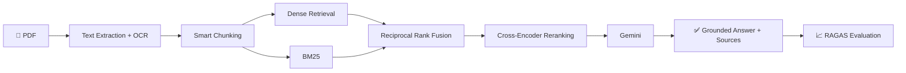
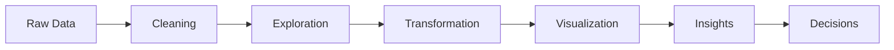
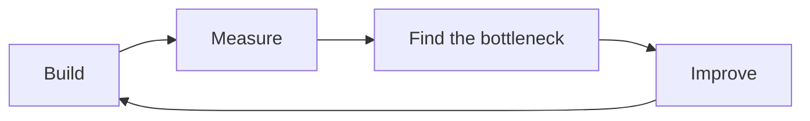
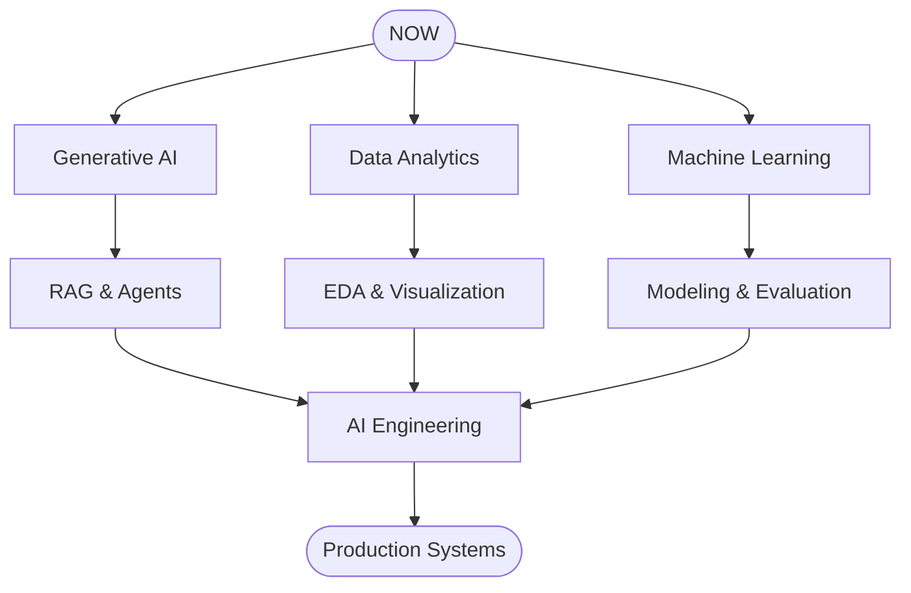

<div align="center">


<a href="https://git.io/typing-svg">
  
</a>

<br/><br/>

<a href="https://shreyansh-nmoy.onrender.com"></a>
<a href="https://www.linkedin.com/in/shreyansh-yadav-2b7856351"></a>
<a href="mailto:shreyanshyadav26289@gmail.com"></a>
<a href="https://github.com/its-sky-2628"></a>

<br/><br/>


</div>

<br/>

## ⚡ Snapshot

<table>
<tr>
<td width="50%" valign="top">

### 👨‍💻 About

I'm a **B.Tech CSE (Data Science)** student at **GL Bajaj Institute of Technology**, Greater Noida (Class of 2028).

I started with **full-stack** (React, Node, MongoDB) and now go deep on **Generative AI, RAG, ML and data analytics**: the kind of systems where *why it works* matters as much as *that it works*.

</td>
<td width="50%" valign="top">

### 🎯 Right now

```yaml
building:    Advanced RAG + evaluation pipelines
exploring:   LLM agents, vector search, reranking
analyzing:   data, KPIs, trends, visualizations
sharpening:  DSA, ML, system design
goal:        production-ready AI engineering
```

</td>
</tr>
</table>

<div align="center">

📍 Greater Noida, India &nbsp;·&nbsp; 🎓 B.Tech CSE (Data Science) &nbsp;·&nbsp; 🗓️ Class of 2028

</div>

---

## 🧩 What I Build

<table>
<tr>
<td align="center" width="25%">
<h3>🤖<br/>Generative AI</h3>
<sub>LLM apps built around real use cases</sub><br/><br/>
<code>LLMs</code> <code>Prompting</code> <code>RAG</code>
</td>
<td align="center" width="25%">
<h3>🔎<br/>AI Search</h3>
<sub>Retrieve the right context before generating</sub><br/><br/>
<code>Embeddings</code> <code>BM25</code> <code>Reranking</code>
</td>
<td align="center" width="25%">
<h3>📊<br/>Data Analytics</h3>
<sub>Raw data to clear, useful insight</sub><br/><br/>
<code>Pandas</code> <code>NumPy</code> <code>Seaborn</code>
</td>
<td align="center" width="25%">
<h3>⚙️<br/>Full-Stack</h3>
<sub>Database to UI, end to end</sub><br/><br/>
<code>React</code> <code>Node</code> <code>MongoDB</code>
</td>
</tr>
</table>

---

## 🛠️ Tech Stack

<div align="center">

<table>
<tr><td align="right"><b>Languages</b></td><td>

</td></tr>
<tr><td align="right"><b>AI / ML</b></td><td>

</td></tr>
<tr><td align="right"><b>Web / Backend</b></td><td>

</td></tr>
<tr><td align="right"><b>Tools & DevOps</b></td><td>

</td></tr>
</table>

<sub><code>Sentence Transformers</code> · <code>Qdrant</code> · <code>BM25</code> · <code>Cross-Encoder</code> · <code>RAGAS</code> · <code>Streamlit</code> · <code>Matplotlib</code> · <code>Seaborn</code></sub>

</div>

---

## 🚀 Featured: Advanced RAG Evaluation

> A production-style RAG pipeline that makes document Q&A **reliable and measurable**, not just plausible.


```mermaid
flowchart LR
    A[📄 PDF] --> B[Text Extraction + OCR]
    B --> C[Smart Chunking]
    C --> D[Dense Retrieval]
    C --> E[BM25]
    D --> F[Reciprocal Rank Fusion]
    E --> F
    F --> G[Cross-Encoder Reranking]
    G --> H[Gemini]
    H --> I[✅ Grounded Answer + Sources]
    I --> J[📈 RAGAS Evaluation]
```

<div align="center">


<br/><br/>

<a href="https://github.com/its-sky-2628/advanced-rag-evaluation"></a>

</div>

---

## 📁 Selected Projects

<table>
<tr>
<td align="center" width="50%">
<a href="https://github.com/its-sky-2628/-CropGuard-AI">

</a>
<br/><sub>🌱 Plant disease detection · computer vision · PlantVillage</sub>
</td>
<td align="center" width="50%">
<a href="https://github.com/its-sky-2628/PolarStation-Command-Center">

</a>
<br/><sub>❄️ Antarctic station ops · forecasting · anomaly detection</sub>
</td>
</tr>
<tr>
<td align="center" width="50%">
<a href="https://github.com/its-sky-2628/-ExperienceHub">

</a>
<br/><sub>🌐 MERN social platform · JWT auth · Bcrypt</sub>
</td>
<td align="center" width="50%">
<a href="https://github.com/its-sky-2628/portfolio">

</a>
<br/><sub>🎨 Developer portfolio · contact form · resume access</sub>
</td>
</tr>
<tr>
<td align="center" width="50%">
<a href="https://github.com/its-sky-2628/Expense-Tracker">

</a>
<br/><sub>💸 Transaction categorization · spending insights</sub>
</td>
<td align="center" width="50%">
<a href="https://github.com/its-sky-2628/Shreyansh">

</a>
<br/><sub>🎓 Student Performance Analyser · Streamlit dashboard</sub>
</td>
</tr>
</table>

<details>
<summary><b>More projects</b></summary>
<br/>

| Project | What it does | Stack |
| :-- | :-- | :-- |
| 🛰️ **FlashGuard AI** | Environmental risk monitoring from rainfall, water-level and terrain signals | `Python` `FastAPI` `Random Forest` `Geospatial` |
| 🧠 **MCQ Auto Clicker** | Chrome extension for question detection, option selection and verification | `JavaScript` `DOM` `Chrome Extension` |

</details>

---

## 📊 Data Analytics Workflow


```mermaid
flowchart LR
    A[Raw Data] --> B[Cleaning] --> C[Exploration] --> D[Transformation] --> E[Visualization] --> F[Insights] --> G[Decisions]
```

<details>
<summary><b>Analytics toolkit</b></summary>
<br/>

| Area | Technologies |
| :-- | :-- |
| Data manipulation | `Pandas` · `NumPy` |
| Visualization | `Matplotlib` · `Seaborn` |
| Statistics | `Descriptive Statistics` · `Correlation` |
| Exploration | `EDA` · `Data Cleaning` |
| Databases | `MySQL` · `MongoDB` |
| Apps & ML | `Streamlit` · `Scikit-learn` |

</details>

---

## 💼 Experience

<table>
<tr>
<td width="140" align="center"><b>Mar – Apr 2026</b><br/><sub>Remote</sub></td>
<td>

**Full Stack Development Intern · Thiranex**

Built production-oriented features with `React` `Node.js` `Express` `MongoDB`: REST APIs, CRUD workflows, frontend-backend integration, debugging and deployment, all in a Git-based workflow.

</td>
</tr>
</table>

---

## 🧠 Engineering Mindset

<div align="center">


```mermaid
flowchart LR
    A[Build] --> B[Measure] --> C[Find the bottleneck] --> D[Improve] --> A
```

</div>

**What I care about:** retrieval quality · data quality · grounded generation · evaluation · clean architecture · reproducibility · real-world usability

> **Don't just make AI generate. Make it retrieve, ground, evaluate and improve.**

---

## 📈 GitHub Stats

<div align="center">


<br/><br/>


</div>

---

## 🗺️ Learning Roadmap


```mermaid
flowchart TB
    NOW([NOW]) --> G[Generative AI]
    NOW --> D[Data Analytics]
    NOW --> M[Machine Learning]
    G --> R[RAG & Agents]
    D --> V[EDA & Visualization]
    M --> E[Modeling & Evaluation]
    R --> AI[AI Engineering]
    V --> AI
    E --> AI
    AI --> P([Production Systems])
```

---

<div align="center">

## 🤝 Let's build something useful

**AI · Data · Software · Open Source**

<br/>

<a href="mailto:shreyanshyadav26289@gmail.com"></a>

<br/><br/>

<a href="https://github.com/its-sky-2628"></a>
<a href="https://www.linkedin.com/in/shreyansh-yadav-2b7856351"></a>
<a href="https://shreyansh-nmoy.onrender.com"></a>

<br/><br/>


</div>
